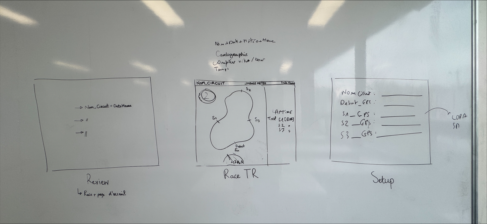

# Application pour ordinateur

### 3 menus disponible :
- Race Temps Réel (IHM personalisé avec différents dashboard)
- Review (choix de courses à visualiser avec titre de chaque course date et heure)
- Setup (coordonnées des sections avec ligne de départ arrive et nom du circuit)

### Dashboard RaceTR
- Nom_circuit 
- Date + heure + météo
- nombre de tours du circuit
- vitesse
- position sur le circuit
- temps (tour, S1, S2, S3) avec différence avec le meilleur temps

## Auteurs

- [@amalraj78](https://www.github.com/amalraj78)
- [@mariam-m95](https://www.github.com/mariam-m95)

