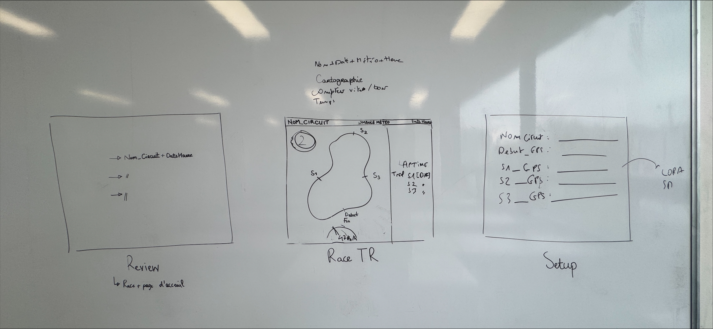
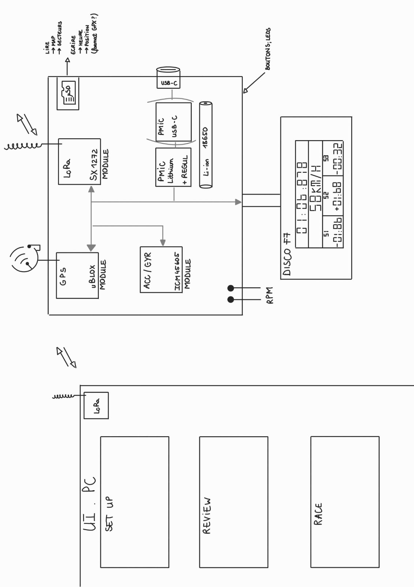

# Kartrack – Application desktop

> **Dépôts associés** :  
> - [Kartrack_SW](https://github.com/erripe13/Kartrack_SW) – Code embarqué STM32 (FreeRTOS, GPS, LoRa, ICM...)  
> - [Kartrack_HW](https://github.com/erripe13/Kartrack_HW) – Schéma et PCB du système  
> - [Kartrack_APP](https://github.com/erripe13/Kartrack_APP) – **Ce dépôt** – Application d’analyse et visualisation des données

## Présentation du projet Kartrack

Kartrack est un système embarqué de chronométrage et de télémétrie pour karting, conçu pour être fixé sur le volant. Il enregistre en temps réel les données de course (position GPS, accélérations, orientation) et les transmet en LoRa à l'appli desktop et les enregistre sur carte microSD. L’objectif est de proposer un outil complet pour les pilotes amateurs ou en compétition : analyse post-course, visualisation en temps réel par l'équipe, appel aux stands, comparaisons de trajectoires.

---

## Application pour ordinateur

### 3 menus disponible :
- Race Temps Réel (IHM personalisé avec différents dashboard)
- Review (choix de courses à visualiser avec titre de chaque course date et heure)
- Setup (coordonnées des sections avec ligne de départ arrive et nom du circuit)

### Dashboard RaceTR
- Nom_circuit 
- Date + heure + météo
- nombre de tours du circuit
- vitesse
- position sur le circuit
- temps (tour, S1, S2, S3) avec différence avec le meilleur temps

### Illustration

## Auteurs

- [@amalraj78](https://www.github.com/amalraj78)
- [@mariam-m95](https://www.github.com/mariam-m95)

## Icones météo

Icons by [Icons8](https://icones8.fr/license)

## API 

- [WeatherAPI](https://www.weatherapi.com/)
